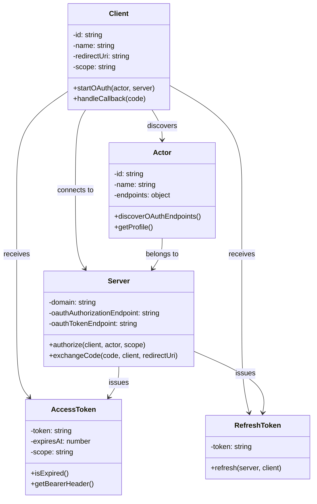

# ActivityPub OAuth 2.0 POC - System Design

## System-Level Class Diagram

```mermaid
classDiagram
    class Actor {
        -id: string
        -name: string
        -endpoints: object
        +discoverOAuthEndpoints()
        +getProfile()
    }

    class Server {
        -domain: string
        -oauthAuthorizationEndpoint: string
        -oauthTokenEndpoint: string
        +authorize(client, actor, scope)
        +exchangeCode(code, client, redirectUri)
    }

    class Client {
        -id: string
        -name: string
        -redirectUri: string
        -scope: string
        +startOAuth(actor, server)
        +handleCallback(code)
    }

    class AccessToken {
        -token: string
        -expiresAt: number
        -scope: string
        +isExpired()
        +getBearerHeader()
    }

    class RefreshToken {
        -token: string
        +refresh(server, client)
    }

    Client --> Actor : discovers
    Client --> Server : connects to
    Client --> AccessToken : receives
    Client --> RefreshToken : receives
    Server --> AccessToken : issues
    Server --> RefreshToken : issues
    Actor --> Server : belongs to
```